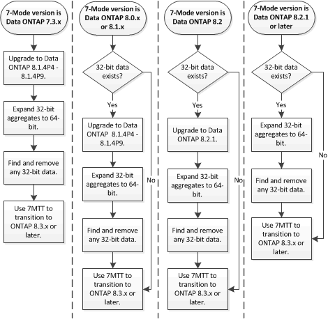

= Preparando-se para a transição para o ONTAP 8,3 e versões posteriores com suporte
:allow-uri-read: 
:icons: font
:imagesdir: ../media/

[role="lead"]
Agregados, volumes e cópias Snapshot de 32 bits não são compatíveis com o ONTAP 8,3 e versões posteriores. Portanto, você precisa expandir os agregados de 32 bits para 64 bits e localizar e remover quaisquer volumes e cópias Snapshot de 32 bits do sistema 7-Mode antes da transição. Como todas as versões de 7 modos não suportam a capacidade de expandir agregados de 32 bits e remover volumes de 32 bits e cópias Snapshot, talvez seja necessário atualizar seu sistema de 7 modos antes da transição.

NOTE: O Clustered Data ONTAP 8.2.x é compatível com agregados, volumes e cópias Snapshot de 32 bits. Portanto, você pode fazer a transição de dados de 32 bits do sistema 7-Mode para um cluster de destino executando o Data ONTAP 8.2.x. No entanto, após a transição, se o cluster de destino tiver de ser atualizado para a versão ONTAP 8,3 ou posterior , terá de atualizar todos os dados de 32 bits existentes no cluster de destino para o formato de 64 bits antes de atualizar a versão ONTAP do cluster de destino.

Você deve usar o fluxo de trabalho a seguir para decidir se uma atualização é necessária antes da transição.

*Informações relacionadas*

https://www.netapp.com/pdf.html?item=/media/19679-tr-3978.pdf["Relatório técnico da NetApp 3978: Expansão in-loco de agregados de 32 bits para visão geral de 64 bits e práticas recomendadas"^]
